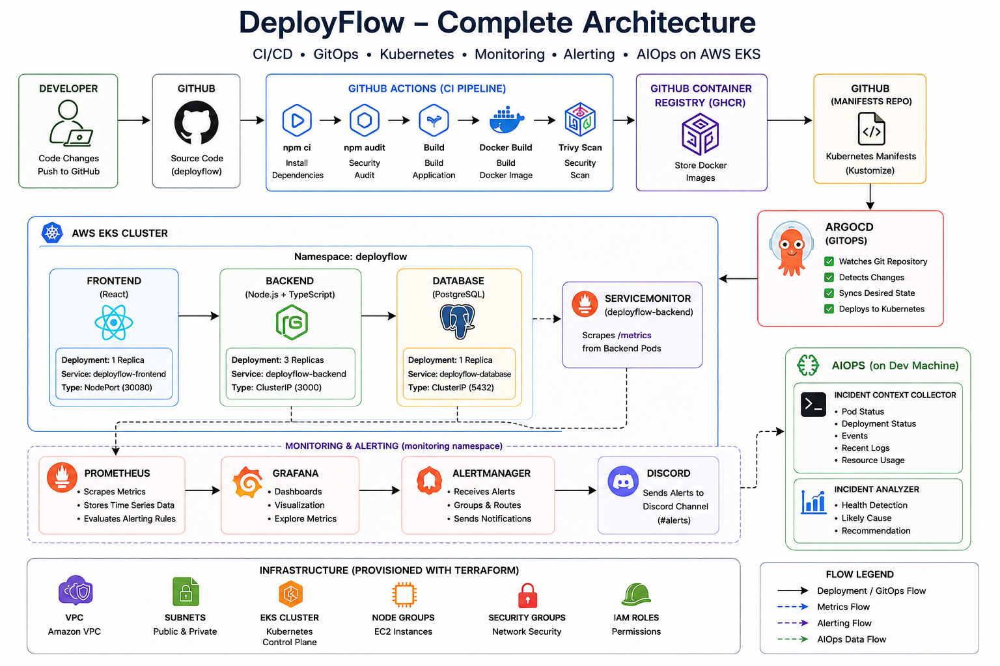
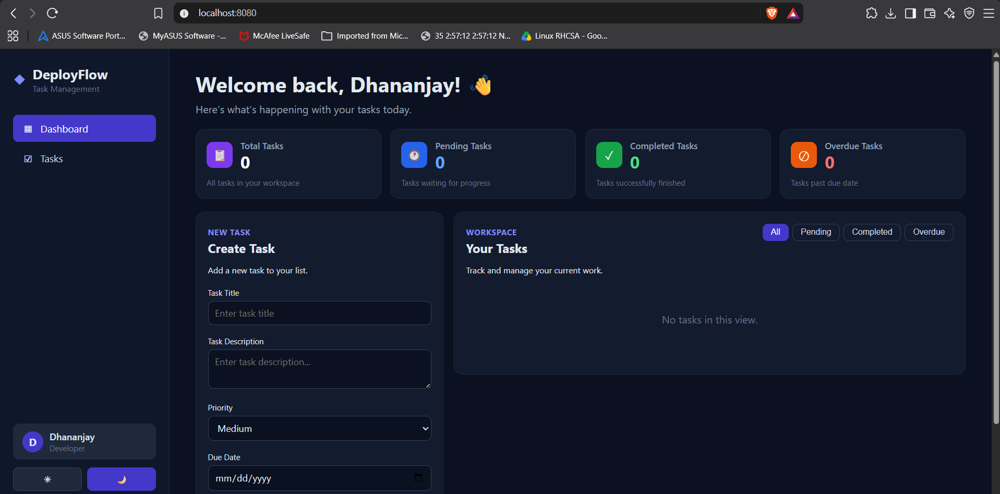
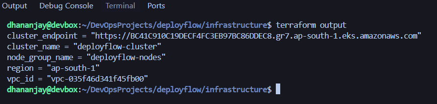
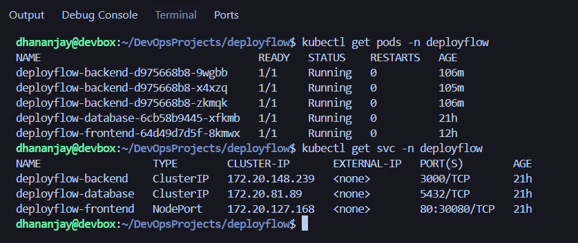
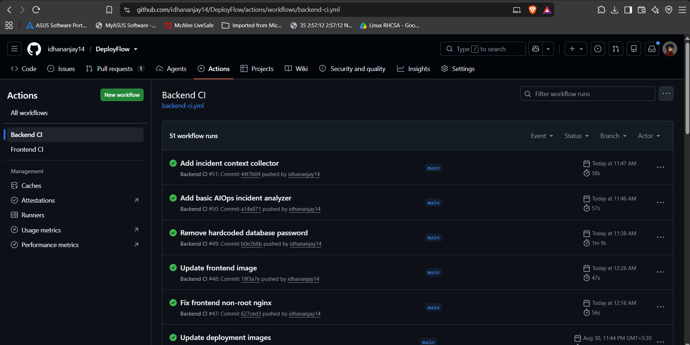
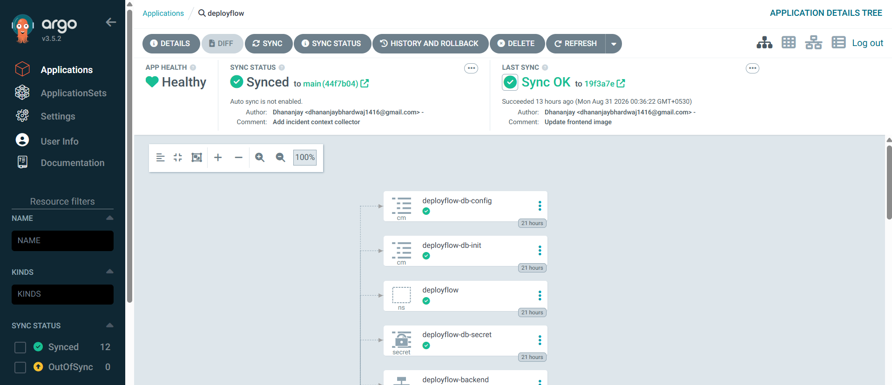
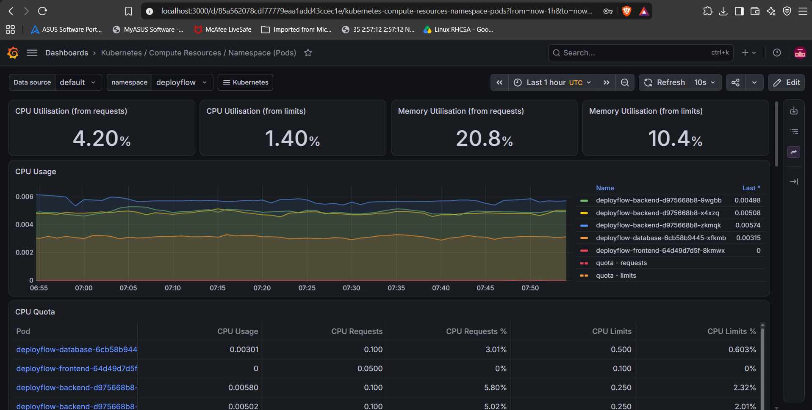
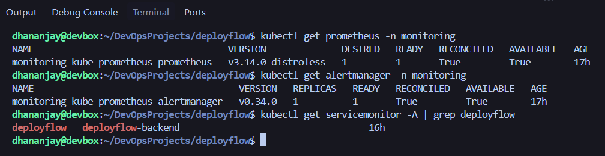
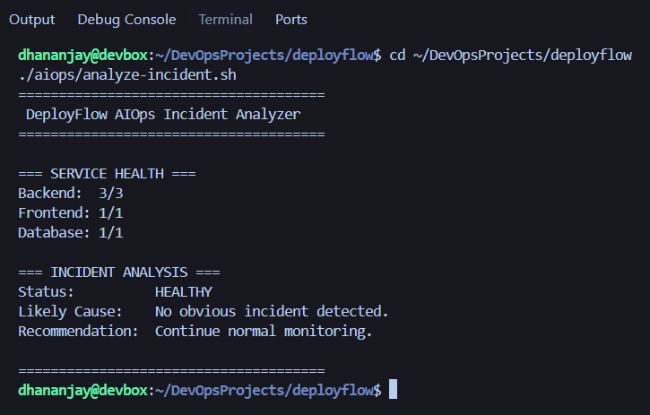

# DeployFlow 🚀

### Cloud-Native DevOps & GitOps Deployment Platform

DeployFlow is an end-to-end cloud-native DevOps project demonstrating infrastructure provisioning, containerization, CI/CD, GitOps deployment, Kubernetes operations, observability, alerting, and AIOps-assisted incident analysis.

## Architecture



## Tech Stack

| Category | Technology |
|---|---|
| Cloud | AWS |
| Infrastructure | Terraform |
| Kubernetes | Amazon EKS |
| Containers | Docker |
| CI | GitHub Actions |
| Registry | GitHub Container Registry |
| GitOps | ArgoCD |
| Configuration | Kustomize |
| Monitoring | Prometheus |
| Dashboards | Grafana |
| Alerting | Alertmanager |
| Notifications | Discord |
| AIOps | Bash + kubectl |
| Frontend | React |
| Backend | Node.js + TypeScript |
| Database | PostgreSQL |

## Project Overview

DeployFlow runs a React frontend, Node.js + TypeScript backend, and PostgreSQL database on Amazon EKS.

The platform demonstrates the complete DevOps lifecycle:

Developer → CI → Container Registry → GitOps → Kubernetes → Monitoring → Alerting → Incident Analysis



## Infrastructure & Kubernetes

AWS infrastructure is provisioned using Terraform and includes the VPC, networking, EKS cluster, node group, and IAM configuration.

The application runs in the `deployflow` namespace:

- Frontend — 1 replica — NodePort `30080`
- Backend — 3 replicas — ClusterIP `3000`
- PostgreSQL — 1 replica — ClusterIP `5432`





## CI/CD & GitOps

GitHub Actions performs application validation, security checks, Docker image builds, Trivy scanning, and publishes images to GHCR.

ArgoCD manages Kubernetes deployment using GitOps.

```text
GitHub
  ├── Application Code
  │       ↓
  │   GitHub Actions
  │       ↓
  │      GHCR
  │
  └── Kubernetes Manifests
          ↓
        ArgoCD
          ↓
        AWS EKS
```





## Monitoring & Alerting

Prometheus collects application and Kubernetes metrics through ServiceMonitor, while Grafana provides visualization.

Prometheus alerts are processed by Alertmanager and routed to Discord.

```
Backend → ServiceMonitor → Prometheus → Grafana
                              ↓
                         Alertmanager
                              ↓
                           Discord
```





## AIOps

DeployFlow includes lightweight AIOps automation for incident investigation.

The incident context collector gathers Kubernetes and application information, while the analyzer evaluates service health and classifies incidents as:

`HEALTHY` · `DEGRADED` · `CRITICAL`

```bash
./aiops/incident-context.sh
./aiops/analyze-incident.sh
```



## How to Use

### Prerequisites

The following tools are required for local development and platform operations:

- Docker
- Node.js
- npm
- kubectl
- Helm
- Terraform
- AWS CLI
- Git

For Kubernetes deployment, an accessible Kubernetes cluster and configured AWS credentials are required.

### Local Development

Clone the repository:

```bash
git clone https://github.com/idhananjay14/DeployFlow.git
cd DeployFlow
```

Start the application locally using Docker Compose:

```bash
docker compose up --build
```

Check running containers:

```bash
docker compose ps
```

Stop the local environment:

```bash
docker compose down
```

### Kubernetes Operations

Check application workloads:

```bash
kubectl get pods -n deployflow
kubectl get svc -n deployflow
```

Check GitOps status:

```bash
kubectl get application -n argocd deployflow
```

Check monitoring:

```bash
kubectl get prometheus -n monitoring
kubectl get alertmanager -n monitoring
kubectl get servicemonitor -A
```

Run AIOps analysis:

```bash
./aiops/analyze-incident.sh
```

Collect incident context:

```bash
./aiops/incident-context.sh
```

## Security

DeployFlow incorporates security checks throughout the application delivery pipeline.

- Dependency auditing with `npm audit`
- Container vulnerability scanning with Trivy
- Non-root container execution
- Secrets excluded from Git
- Kubernetes namespace isolation
- Git SHA-based container image tagging
- Environment-specific configuration kept outside source control

Sensitive configuration such as `.env`, Terraform variables, and Terraform state files are excluded from version control.

## Final Validation

| Component | Status |
|---|---|
| ArgoCD | Synced / Healthy |
| Backend | 3/3 Ready |
| Frontend | 1/1 Ready |
| Database | 1/1 Ready |
| Prometheus | Ready |
| Alertmanager | Ready / Reconciled |
| AIOps | HEALTHY |
| Discord | Alert delivery verified |

## Project Structure

```text
deployflow/
├── .github/
├── aiops/
├── argocd/
├── backend/
├── frontend/
├── database/
├── infrastructure/
├── kubernetes/
├── monitoring/
├── docs/
├── docker-compose.yml
├── .gitignore
└── README.md
```
